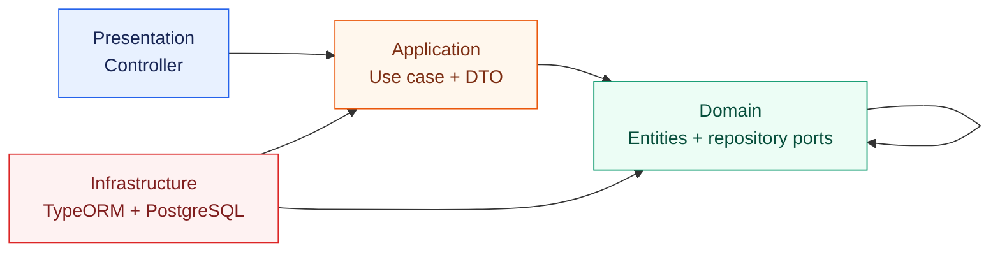
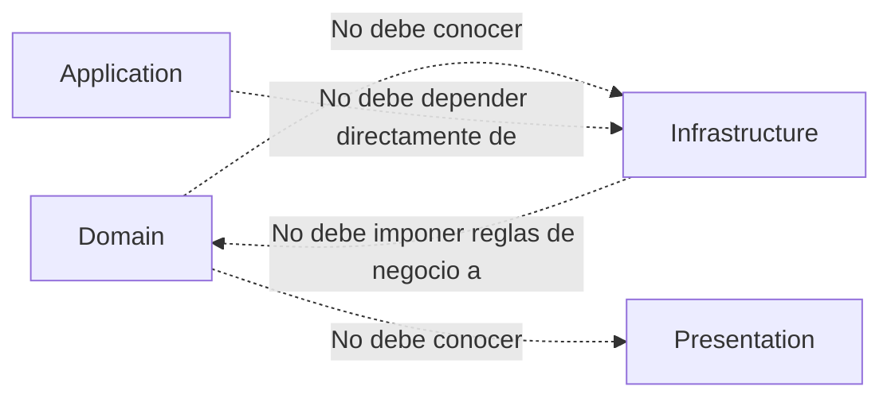
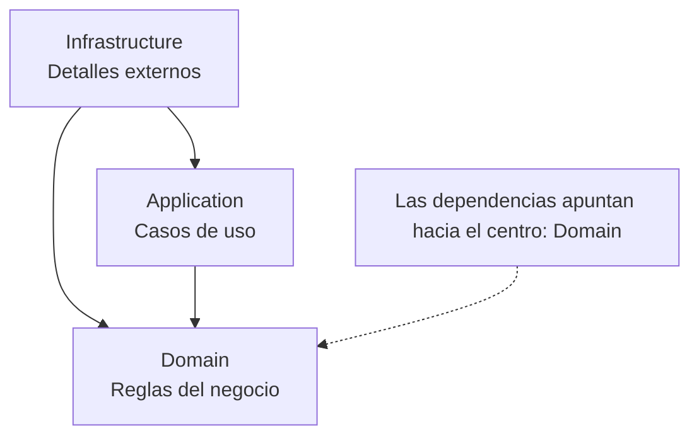
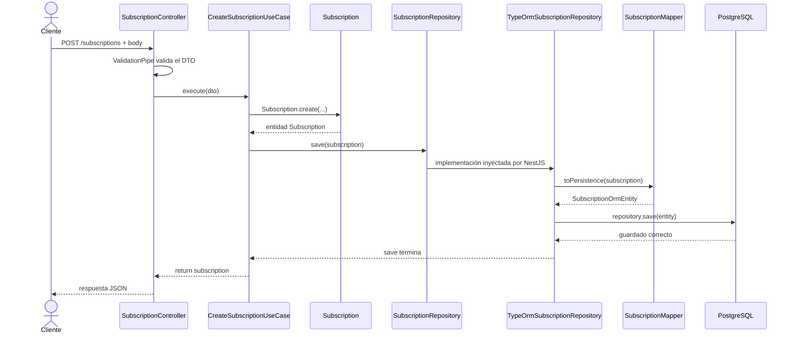

# Flujo de creación de una suscripción

Este documento explica, paso a paso, qué ocurre cuando un cliente llama al endpoint `POST /subscriptions` en este proyecto. El objetivo es entender cómo se conectan las capas de una arquitectura limpia y por qué cada pieza tiene esa responsabilidad.

## 1. Vista general

El recorrido principal es:

```text
Cliente HTTP
    |
    v
POST /subscriptions
    |
    v
ValidationPipe + CreateSubscriptionDto
    |
    v
SubscriptionController
    |
    v
CreateSubscriptionUseCase
    |
    v
Subscription (entidad de dominio)
    |
    v
SubscriptionRepository (puerto o contrato)
    |
    v
TypeOrmSubscriptionRepository (adaptador)
    |
    v
SubscriptionMapper
    |
    v
SubscriptionOrmEntity
    |
    v
TypeORM -> PostgreSQL
```

La idea central es que el dominio y el caso de uso no dependan directamente de TypeORM o PostgreSQL. La infraestructura se conecta mediante un contrato (`SubscriptionRepository`).

## 1.1. Vista gráfica de las dependencias entre capas

En arquitectura limpia, las flechas de este diagrama representan **dependencias de código**: la capa que está al inicio de la flecha puede importar o conocer a la capa que está al final.



La lectura del diagrama es:

| Capa             | Puede usar               | Ejemplo en este módulo                                                                   |
| ---------------- | ------------------------ | ---------------------------------------------------------------------------------------- |
| `presentation`   | `application`            | El controller ejecuta `CreateSubscriptionUseCase`.                                       |
| `application`    | `domain`                 | El caso de uso crea `Subscription` y usa `SubscriptionRepository`.                       |
| `domain`         | `domain`                 | La entidad usa sus propios tipos, enums y reglas. No conoce NestJS ni TypeORM.           |
| `infrastructure` | `application` y `domain` | El módulo conecta dependencias; el repositorio TypeORM implementa el puerto del dominio. |

La flecha `infrastructure --> application` aparece porque el módulo de NestJS registra el caso de uso y el token del repositorio. En términos de negocio, la infraestructura no decide qué hacer: proporciona los mecanismos concretos para ejecutar lo que la aplicación necesita.

### Dependencias que se deben evitar



Por ejemplo, sería una mala dirección que `Subscription` importara `Repository` de TypeORM. La entidad debe permanecer utilizable aunque mañana se cambie TypeORM, PostgreSQL o NestJS.

### Regla sencilla para recordarlo



En este proyecto, `domain` es el centro de la lógica de suscripciones. `application` coordina esa lógica y `infrastructure` adapta bases de datos y frameworks para que puedan utilizarla.

## 1.2. Vista gráfica del flujo de ejecución

Este es el orden temporal cuando llega un `POST /subscriptions`. Aquí las flechas muestran **qué llama a qué durante la ejecución**, no únicamente las dependencias de código.



Este segundo diagrama ayuda a diferenciar dos conceptos:

- El **diagrama de dependencias** explica quién puede conocer o importar a quién.
- El **diagrama de secuencia** explica qué ocurre primero, qué ocurre después y cómo vuelve la respuesta.

## 2. Entrada de la petición HTTP

El módulo registra el controller con la ruta base `subscriptions`:

- [subscription.controller.ts](../src/modules/subscriptions/presentation/http/controllers/subscription.controller.ts)

```ts
@Controller('subscriptions')
export class SubscriptionController {
  @Post()
  async create(@Body() dto: CreateSubscriptionDto) {
    return this.createSubscriptionUseCase.execute(dto);
  }
}
```

Por tanto, una petición como esta entra en el método `create`:

```http
POST /subscriptions
Content-Type: application/json

{
  "studentId": "550e8400-e29b-41d4-a716-446655440000",
  "plan": "PREMIUM"
}
```

### ¿Qué responsabilidad tiene el controller?

El controller pertenece a la capa de **presentación**. Su trabajo es adaptar HTTP al lenguaje de la aplicación:

1. Recibir la petición.
2. Obtener el body mediante `@Body()`.
3. Entregar ese body al caso de uso.
4. Devolver el resultado al cliente.

No decide cómo se crea una suscripción, no genera el UUID y no guarda directamente en la base de datos. Eso evita que la lógica de negocio quede mezclada con HTTP.

## 3. Validación del DTO

El objeto recibido se tipa como `CreateSubscriptionDto`:

- [create-subscription.dto.ts](../src/modules/subscriptions/application/dto/create-subscription.dto.ts)

```ts
export class CreateSubscriptionDto {
  @IsUUID()
  studentId: string;

  @IsEnum(SubscriptionPlan)
  plan: SubscriptionPlan;
}
```

Este DTO describe los datos necesarios para iniciar el caso de uso:

- `studentId` debe ser un UUID válido.
- `plan` debe ser uno de `BASIC`, `PREMIUM` o `PRO`.

La validación se activa globalmente en:

- [main.ts](../src/main.ts)

```ts
app.useGlobalPipes(
  new ValidationPipe({
    whitelist: true,
    forbidNonWhitelisted: true,
    transform: true,
  }),
);
```

Esto significa:

- `whitelist: true`: conserva únicamente propiedades declaradas en el DTO.
- `forbidNonWhitelisted: true`: rechaza propiedades adicionales en lugar de ignorarlas silenciosamente.
- `transform: true`: permite transformar los datos de entrada a las clases y tipos esperados cuando corresponde.

Si el body no cumple estas reglas, NestJS responde con un error de validación y el caso de uso ni siquiera se ejecuta.

### DTO frente a entidad

El DTO no es la entidad de negocio. El DTO representa datos de entrada de una petición concreta. La entidad representa una suscripción válida dentro del dominio.

Por ejemplo, el cliente no envía `id`, `status` ni `startDate`. Esos valores los decide la aplicación, no el cliente.

## 4. El controller delega al caso de uso

Después de la validación, el controller ejecuta:

```ts
return this.createSubscriptionUseCase.execute(dto);
```

El caso de uso está en:

- [create-subscription.use-case.ts](../src/modules/subscriptions/application/use-cases/create-subscription.use-case.ts)

Un **caso de uso** representa una acción que el sistema puede realizar. En este caso, la acción es “crear una suscripción”.

El controller no contiene la lógica porque podrían existir otros puntos de entrada para la misma acción, por ejemplo un consumidor de mensajes, un comando interno o un job. Todos podrían reutilizar el caso de uso sin depender de HTTP.

## 5. Creación de la entidad de dominio

El caso de uso construye la suscripción:

```ts
const subscription = Subscription.create({
  id: randomUUID(),
  studentId: dto.studentId,
  plan: dto.plan,
  status: SubscriptionStatus.ACTIVE,
  startDate: new Date(),
  endDate: null,
});
```

Aquí se completan los datos que el cliente no debía controlar:

- `id`: se genera dentro de la aplicación con `randomUUID()`.
- `status`: una suscripción nueva comienza como `ACTIVE`.
- `startDate`: se establece en el momento de la creación.
- `endDate`: comienza como `null` porque todavía no ha terminado.

La entidad está definida en:

- [subscription.entity.ts](../src/modules/subscriptions/domain/entities/subscription.entity.ts)

```ts
export class Subscription {
  private constructor(
    public readonly id: string,
    public readonly studentId: string,
    public readonly plan: SubscriptionPlan,
    public readonly status: SubscriptionStatus,
    public readonly startDate: Date,
    public readonly endDate: Date | null,
  ) {}

  static create(props: CreateSubscriptionProps): Subscription {
    return new Subscription(
      props.id,
      props.studentId,
      props.plan,
      props.status,
      props.startDate,
      props.endDate,
    );
  }
}
```

### ¿Por qué existe una entidad de dominio?

La entidad es el objeto que representa el concepto importante del negocio: una suscripción. El dominio debería poder entenderse sin conocer NestJS, TypeORM, PostgreSQL o HTTP.

En este caso:

- El constructor es `private`, así que el código externo no puede crear la entidad de cualquier manera.
- `Subscription.create(...)` es una fábrica estática que centraliza la creación.
- Las propiedades son `readonly`, por lo que no se modifican accidentalmente después de crear el objeto.
- Los enums limitan los valores posibles de plan y estado.

Actualmente la entidad es sencilla y no tiene reglas complejas adicionales. Si mañana una suscripción necesitara métodos como `cancel()` o `expire()`, esas reglas pertenecerían al dominio, no al controller ni al repositorio.

## 6. El caso de uso usa un puerto de repositorio

Una vez creada la entidad, el caso de uso la guarda:

```ts
await this.subscriptionRepository.save(subscription);
return subscription;
```

Estas dos líneas cumplen funciones diferentes:

### `await this.subscriptionRepository.save(subscription)`

Esta línea ejecuta la persistencia. El caso de uso le entrega la entidad al repositorio y espera a que el repositorio termine de guardarla en la base de datos.

`await` es importante porque guardar en la base de datos es una operación asíncrona. Mientras no termine, el caso de uso todavía no debería indicar que la creación finalizó.

En este proyecto, `save` está declarado como `Promise<void>`. Eso significa que el repositorio informa si la operación terminó correctamente, pero no devuelve otra entidad:

```ts
save(subscription: Subscription): Promise<void>;
```

La entidad ya tiene todos sus valores antes de guardarse: el UUID, el plan, el estado y las fechas son creados por la aplicación. Por eso el caso de uso no necesita utilizar el valor devuelto por TypeORM.

Si la base de datos falla, el `await` lanza un error y la siguiente línea no se ejecuta. En ese caso, la operación no devuelve una suscripción creada como si todo hubiera salido bien.

### `return subscription`

Esta línea no guarda nada. Devuelve la entidad que ya fue guardada para que el siguiente nivel pueda utilizarla.

El recorrido del valor retornado es:

```text
CreateSubscriptionUseCase.execute()
    |
    | return subscription
    v
SubscriptionController.create()
    |
    | return this.createSubscriptionUseCase.execute(dto)
    v
NestJS serializa el resultado como respuesta HTTP JSON
```

Por eso `return subscription` se usa después del `save`: primero se confirma la persistencia y solamente después se entrega el resultado al cliente. El controller no necesita recibirlo en una variable porque lo retorna directamente:

```ts
@Post()
async create(@Body() dto: CreateSubscriptionDto) {
  return this.createSubscriptionUseCase.execute(dto);
}
```

Como `execute` es `async`, su tipo real es `Promise<Subscription>`. El controller retorna esa promesa y NestJS espera a que se resuelva. Cuando se resuelve, NestJS convierte la entidad en JSON, por ejemplo:

```json
{
  "id": "uuid-generado",
  "studentId": "550e8400-e29b-41d4-a716-446655440000",
  "plan": "PREMIUM",
  "status": "ACTIVE",
  "startDate": "2026-09-10T12:00:00.000Z",
  "endDate": null
}
```

En resumen:

```text
save  = efecto permanente: guardar en la base de datos
return = resultado de la operación: entregar la suscripción al controller/cliente
```

El caso de uso conoce solamente este contrato:

- [subscription.repository.ts](../src/modules/subscriptions/domain/repositories/subscription.repository.ts)

```ts
export interface SubscriptionRepository {
  save(subscription: Subscription): Promise<void>;

  findById(id: string): Promise<Subscription | null>;
}
```

Este interface es un **puerto**. Define lo que la aplicación necesita hacer con suscripciones, pero no dice cómo se hará.

### ¿Por qué no se usa TypeORM directamente en el caso de uso?

Porque el caso de uso no debería quedar acoplado a una tecnología concreta. Gracias al contrato:

- El caso de uso puede probarse usando un repositorio falso en memoria.
- Se podría cambiar PostgreSQL por otra base de datos.
- Se podría cambiar TypeORM por Prisma u otro adaptador.
- Las reglas de negocio no dependen de detalles de persistencia.

Esto es inversión de dependencias: la lógica importante depende de una abstracción y la infraestructura se adapta a ella.

## 7. Cómo NestJS inyecta la implementación

La conexión entre el contrato y la implementación está en:

- [subscriptions.module.ts](../src/modules/subscriptions/subscriptions.module.ts)
- [tokens.ts](../src/modules/subscriptions/application/tokens.ts)

```ts
{
  provide: SUBSCRIPTION_REPOSITORY,
  useClass: TypeOrmSubscriptionRepository,
}
```

Y el caso de uso solicita ese puerto mediante el token:

```ts
constructor(
  @Inject(SUBSCRIPTION_REPOSITORY)
  private readonly subscriptionRepository: SubscriptionRepository,
) {}
```

El interface de TypeScript no existe en tiempo de ejecución, por eso NestJS necesita un token real (`Symbol`) para identificar la dependencia. En tiempo de ejecución, NestJS interpreta la configuración así:

```text
Cuando alguien pida SUBSCRIPTION_REPOSITORY,
entrega una instancia de TypeOrmSubscriptionRepository.
```

El módulo también importa el repositorio de TypeORM:

```ts
imports: [TypeOrmModule.forFeature([SubscriptionOrmEntity])];
```

Eso permite que NestJS inyecte el `Repository<SubscriptionOrmEntity>` que TypeORM administra.

## 8. Adaptador de persistencia

La implementación concreta está en:

- [typeorm-subscription.repository.ts](../src/modules/subscriptions/infrastructure/persistence/typeorm/typeorm-subscription.repository.ts)

```ts
async save(subscription: Subscription): Promise<void> {
  const entity = SubscriptionMapper.toPersistence(subscription);

  await this.repository.save(entity);
}
```

Esta clase pertenece a **infraestructura** porque conoce TypeORM. Implementa el contrato del dominio, pero el dominio no conoce esta clase.

Su trabajo es:

1. Recibir una entidad de dominio.
2. Convertirla a una entidad compatible con TypeORM.
3. Pedirle a TypeORM que la guarde.

`@InjectRepository(SubscriptionOrmEntity)` le dice a NestJS que entregue el repositorio de TypeORM asociado a la tabla de suscripciones.

## 9. Mapper: separar dominio y persistencia

La conversión se hace en:

- [subscription.mapper.ts](../src/modules/subscriptions/infrastructure/persistence/typeorm/subscription.mapper.ts)

```ts
static toPersistence(domain: Subscription): SubscriptionOrmEntity {
  const entity = new SubscriptionOrmEntity();

  entity.id = domain.id;
  entity.studentId = domain.studentId;
  entity.plan = domain.plan;
  entity.status = domain.status;
  entity.startDate = domain.startDate;
  entity.endDate = domain.endDate;

  return entity;
}
```

El mapper evita que la entidad de dominio sea usada directamente como entidad de TypeORM.

Esto es importante porque tienen propósitos distintos:

| Objeto                  | Representa                     | Conoce                    |
| ----------------------- | ------------------------------ | ------------------------- |
| `Subscription`          | Concepto y reglas del negocio  | Dominio                   |
| `SubscriptionOrmEntity` | Forma de guardar datos         | TypeORM y base de datos   |
| `SubscriptionMapper`    | Conversión entre ambos modelos | Dominio e infraestructura |

Si los nombres de las columnas o la tecnología de persistencia cambian, el cambio queda concentrado en infraestructura.

## 10. Entidad ORM y tabla de base de datos

La entidad ORM está en:

- [subscription.orm-entity.ts](../src/modules/subscriptions/infrastructure/persistence/typeorm/subscription.orm-entity.ts)

```ts
@Entity('subscriptions')
export class SubscriptionOrmEntity {
  @PrimaryColumn('uuid')
  id: string;

  @Column({ name: 'student_id', type: 'uuid' })
  studentId: string;

  @Column({ type: 'enum', enum: SubscriptionPlan })
  plan: SubscriptionPlan;

  @Column({ type: 'enum', enum: SubscriptionStatus })
  status: SubscriptionStatus;

  @Column({ name: 'start_date', type: 'timestamptz' })
  startDate: Date;

  @Column({ name: 'end_date', type: 'timestamptz', nullable: true })
  endDate: Date | null;
}
```

Los decoradores le indican a TypeORM cómo mapear la clase a PostgreSQL:

- `@Entity('subscriptions')`: usa la tabla `subscriptions`.
- `@PrimaryColumn('uuid')`: `id` es la clave primaria y usa UUID.
- `name: 'student_id'`: la propiedad TypeScript `studentId` se guarda como `student_id`.
- `type: 'enum'`: PostgreSQL restringe los valores de `plan` y `status`.
- `timestamptz`: guarda fechas con zona horaria.
- `nullable: true`: `end_date` puede estar vacío.

La migración confirma la estructura física de la tabla:

- [1788969622734-InitialSchema.ts](../src/database/migrations/1788969622734-InitialSchema.ts)

Cuando TypeORM ejecuta `repository.save(entity)`, genera y ejecuta la operación SQL necesaria contra la tabla `subscriptions`.

## 11. Respuesta al cliente

Después de guardar:

1. `TypeOrmSubscriptionRepository.save` termina.
2. El caso de uso devuelve la entidad `Subscription`.
3. El controller devuelve ese resultado.
4. NestJS lo serializa como JSON en la respuesta HTTP.

La respuesta tendrá aproximadamente esta forma:

```json
{
  "id": "uuid-generado",
  "studentId": "550e8400-e29b-41d4-a716-446655440000",
  "plan": "PREMIUM",
  "status": "ACTIVE",
  "startDate": "2026-09-10T12:00:00.000Z",
  "endDate": null
}
```

## 12. Qué ocurre si hay un error

- Body inválido: falla `ValidationPipe`; el caso de uso no se ejecuta.
- Error al construir la entidad: falla el caso de uso.
- Error de base de datos: falla el repositorio TypeORM y el error sube hacia NestJS.
- El controller no captura errores aquí, por lo que NestJS aplica su manejo HTTP global.

## 13. Flujo de lectura que ya existe

El contrato y el repositorio también tienen `findById`:

```ts
async findById(id: string): Promise<Subscription | null>
```

Su recorrido interno es el inverso del guardado:

```text
Base de datos
    |
    v
SubscriptionOrmEntity
    |
    v
SubscriptionMapper.toDomain(...)
    |
    v
Subscription
```

El método `toDomain` reconstruye una entidad de dominio a partir del registro ORM. Sin embargo, en el estado actual del módulo no hay un caso de uso ni una ruta HTTP que exponga `findById`; el método está preparado como parte del repositorio, pero todavía no forma parte de un flujo público completo.

## 14. Resumen de responsabilidades

| Capa            | Pieza                           | Responsabilidad                         |
| --------------- | ------------------------------- | --------------------------------------- |
| Presentación    | `SubscriptionController`        | Recibir HTTP y delegar                  |
| Aplicación      | `CreateSubscriptionDto`         | Definir y validar la entrada            |
| Aplicación      | `CreateSubscriptionUseCase`     | Coordinar la creación                   |
| Dominio         | `Subscription`                  | Representar la suscripción y sus reglas |
| Dominio         | `SubscriptionRepository`        | Definir el contrato de persistencia     |
| Infraestructura | `TypeOrmSubscriptionRepository` | Implementar el contrato con TypeORM     |
| Infraestructura | `SubscriptionMapper`            | Convertir dominio y persistencia        |
| Infraestructura | `SubscriptionOrmEntity`         | Mapear datos a la tabla PostgreSQL      |
| Composición     | `SubscriptionsModule`           | Conectar todas las dependencias         |

## 15. Idea para recordar la arquitectura

Una forma sencilla de leer este flujo es:

```text
HTTP dice qué quiere el usuario.
El caso de uso decide qué operación ejecutar.
El dominio representa qué significa la operación.
El puerto declara qué necesita la aplicación.
La infraestructura decide cómo persistirlo.
El módulo conecta las piezas.
```

La dirección importante es que la lógica de negocio no debería depender de los detalles externos. HTTP, NestJS, TypeORM y PostgreSQL son mecanismos que pueden cambiar; la idea de una suscripción y las reglas para crearla pertenecen al dominio y a la aplicación.
